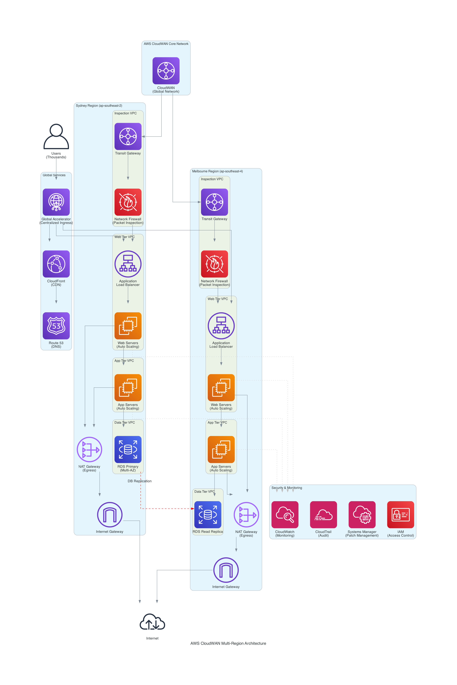

# LZBot-5000: AWS Landing Zone Designer

An intelligent AWS Landing Zone design tool that leverages AWS Bedrock, Strands framework, and AWS Diagram MCP Server to automatically generate comprehensive, Well-Architected Framework-compliant landing zone architectures with professional diagrams and implementation guides.

## 🚀 Overview

LZBot-5000 is an automated AWS Landing Zone designer that combines the power of:

- **AWS Bedrock** (Claude Sonnet) for intelligent architecture design
- **Strands Framework** for AI agent orchestration
- **AWS Diagram MCP Server** for professional architecture diagram generation
- **Automated Documentation** generation with implementation backlogs

The tool takes natural language queries about your AWS requirements and produces:

- Professional architecture diagrams
- Detailed implementation guides
- Well-Architected Framework compliance documentation
- Sprint-based implementation backlogs
- Cost optimization strategies

## 🏗️ Key Components

### AWS Bedrock Integration

- **Model**: `apac.anthropic.claude-sonnet-4-20250514-v1:0`
- **Region**: `ap-southeast-2` (Sydney)
- Provides expert-level AWS Solutions Architect knowledge
- Well-Architected Framework compliance

### Strands Framework

- AI agent orchestration and tool integration
- Seamless integration with MCP servers
- Structured prompt engineering for consistent outputs

### AWS Diagram MCP Server

- **Server**: `awslabs.aws-diagram-mcp-server@latest`
- **Transport**: STDIO via `uvx`
- Generates professional AWS architecture diagrams
- Supports multiple output formats (PNG, SVG, PDF)
- Automatic diagram file management and organization

### Documentation Generator

- Markdown-formatted architecture documentation
- Timestamped design records
- Implementation backlogs with sprint planning
- Cost optimization recommendations

## 📋 Prerequisites

### AWS Setup

- AWS CLI configured with appropriate credentials
- Access to AWS Bedrock in `ap-southeast-2` region
- Permissions for Claude Sonnet model usage

### Python Environment

```bash
# Python 3.8+ required
python --version

# Install dependencies
pip install strands
pip install mcp
```

### MCP Server Requirements

```bash
# Install uvx for MCP server management
pip install uvx

# Verify AWS Diagram MCP Server availability
uvx awslabs.aws-diagram-mcp-server@latest --help
```

## 🛠️ Installation

1. **Clone the repository**

   ```bash
   git clone https://github.com/chungos/lzbot-5000.git
   cd lzbot-5000
   ```

2. **Install dependencies**

   ```bash
   pip install -r requirements.txt
   ```

3. **Configure AWS credentials**

   ```bash
   aws configure
   # Ensure access to Bedrock in ap-southeast-2
   ```

4. **Verify setup**

   ```bash
   python main.py
   ```

## 🎯 Usage Guide

### Basic Usage

Run the tool with the default query:

```bash
python main.py
```

The default query designs a CloudWAN network across Melbourne and Sydney regions with:

- Centralised packet inspection
- Decentralised egress
- Centralised ingress
- Support for thousands of users
- Strong security controls
- Predictable costs

### Custom Queries

Modify the `query` variable in `main.py` to design different architectures:

```python
query = (
    "Design a multi-account AWS landing zone for a financial services company "
    "requiring APRA compliance, with separate accounts for dev, test, and prod, "
    "centralised logging, and network segmentation."
)
```

### Query Examples

**Multi-Region Web Application**

```python
query = "Design a global web application architecture across 3 regions with auto-scaling, CDN, and disaster recovery"
```

**Compliance-Heavy Environment**

```python
query = "Create a HIPAA-compliant landing zone with data encryption, audit logging, and network isolation"
```

**Cost-Optimized Startup**

```python
query = "Design a cost-effective landing zone for a startup with growth potential and minimal operational overhead"
```

## 📊 Understanding Outputs

### Generated Files Structure

```
outputs/
├── aws_design_YYYYMMDD_HHMMSS.md    # Detailed documentation
└── architecture_diagram.png          # Professional diagram
```

### Documentation Sections

1. **Executive Summary** - High-level architecture overview
2. **Detailed Architecture Design** - Component-by-component breakdown
3. **Security Controls** - Comprehensive security implementation
4. **Implementation Backlog** - Sprint-based delivery plan
5. **Cost Optimization** - Strategies for cost management
6. **Next Steps** - Actionable implementation guidance

### Implementation Backlog Format

- **Sprint-based planning** (2-week sprints)
- **T-shirt sizing** (Small, Medium, Large)
- **Definition of Done** for each story
- **Dependencies** clearly identified
- **Well-Architected Framework** alignment

## 🔧 Architecture Features

### Well-Architected Framework Compliance

Every design adheres to the five pillars:

- **Operational Excellence** - Centralized management and automation
- **Security** - Defense in depth, encryption, access controls
- **Reliability** - Multi-AZ deployment, disaster recovery
- **Performance Efficiency** - Auto-scaling, caching, optimization
- **Cost Optimization** - Right-sizing, reserved instances, monitoring

### Network Architecture Patterns

- **Hub and Spoke** with Transit Gateway
- **CloudWAN** for global connectivity
- **Centralized Inspection** with AWS Network Firewall
- **Decentralized Egress** for cost optimization
- **Centralized Ingress** with Global Accelerator

### Security Controls

- **Identity and Access Management** - Least privilege access
- **Network Security** - VPC Flow Logs, Security Groups, NACLs
- **Data Protection** - Encryption at rest and in transit
- **Monitoring** - CloudTrail, CloudWatch, Config
- **Compliance** - Ready for SOC 2, ISO 27001, APRA

## 📈 Example Output

### Sample Architecture Diagram



### Generated Documentation Structure

```markdown
# AWS CloudWAN Architecture Design

**Generated on:** 2025-09-18 10:01:34
**Query:** Design a real-world AWS cloudWAN network...

## Architecture Diagram


## Design Details and Implementation Guide

### 1. Global Network Layer (CloudWAN Core)

### 2. Regional Architecture Components

### 3. Traffic Flow Design

### 4. Security Controls

### 5. Monitoring and Observability

### 6. High Availability and Disaster Recovery

### 7. Cost Optimization Strategy

## Implementation Backlog

### Sprint 1 (2 weeks) - Foundation Setup

### Sprint 2 (2 weeks) - Sydney Region Completion

...
```

## 🔄 Customization

### Modifying the System Prompt

Edit the `SYSTEM_PROMPT` variable in `main.py` to:

- Change default region preferences
- Add specific compliance requirements
- Modify output format preferences
- Include organization-specific standards

### Diagram Customization

The AWS Diagram MCP Server supports various customization options:

- Output formats (PNG, SVG, PDF)
- Diagram themes and styling
- Component positioning
- Label customization

### Output Directory Structure

Modify `diagram_dir` and output paths to organize files according to your preferences:

```python
diagram_dir = "./outputs"  # Change to your preferred directory
```

## 🛠️ Development

### Project Structure

```
lzbot-5000/
├── main.py                 # Main application
├── README.md              # This file
├── requirements.txt       # Python dependencies
├── outputs/              # Generated designs and diagrams
├── examples/             # Example outputs
└── src/                  # Source code (if expanded)
```

### Key Functions

- `extract_diagram_path()` - Parses diagram paths from agent output
- `handle_diagram_file()` - Manages diagram file operations
- `create_markdown_content()` - Generates formatted documentation

### Contributing

1. Fork the repository
2. Create a feature branch
3. Make your changes
4. Add tests if applicable
5. Submit a pull request

### Local Development

```bash
# Install development dependencies
pip install -r requirements-dev.txt

# Run tests
python -m pytest

# Format code
black main.py

```

## 📚 Additional Resources

- [AWS Well-Architected Framework](https://aws.amazon.com/architecture/well-architected/)
- [AWS Landing Zone Best Practices](https://aws.amazon.com/solutions/implementations/aws-landing-zone/)
- [Strands Framework Documentation](https://github.com/strands-ai/strands)
- [AWS Diagram MCP Server](https://github.com/awslabs/aws-diagram-mcp-server)

## 🤝 Support

For issues, questions, or contributions:

- Create an issue in the GitHub repository
- Review existing examples in the `examples/` directory
- Check the generated documentation for implementation guidance

## TODO

- [ ] parameterise inputs
- [ ] refactor code into separate module
- [ ] add confluence MCP for design publishing
- [ ] add confluence MCP for run books
- [ ] add jira MCP for backlogs
- [ ] add github/gitlab integration for infrastructure-as-code
- [ ] add CICD pipelines

## 📄 License

This project is licensed under the unlicense License - see the [LICENSE](LICENSE) file for details.

---
