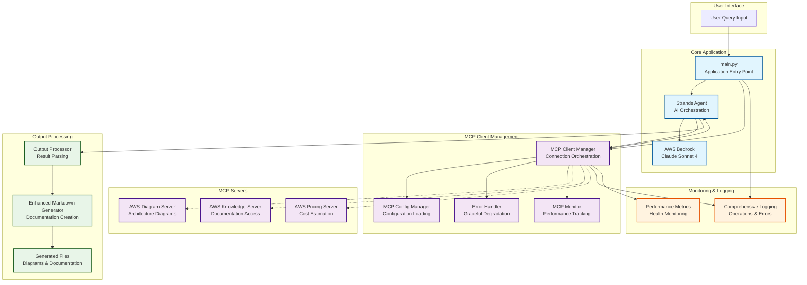
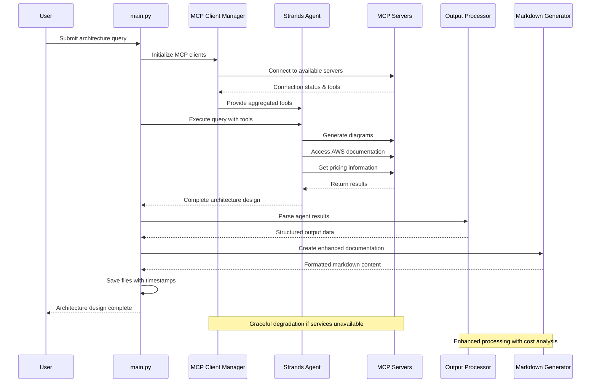
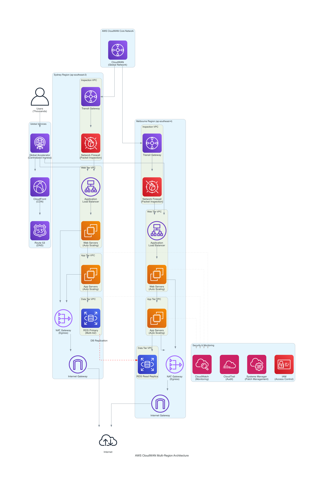

# LZBot-5000: AWS Landing Zone Designer

An AWS Landing Zone design tool that leverages AWS Bedrock, Strands framework, and MCP Server for AWS diagrams, AWS pricing & AWS knowledge to  generate comprehensive, well-architected Framework-compliant landing zone architectures with professional diagrams and implementation guides.

## 🚀 Overview

LZBot-5000 is an automated AWS Landing Zone designer that combines the power of:

- **AWS Bedrock** (Claude Sonnet) for intelligent architecture design
- **Strands Framework** for AI agent orchestration
- **AWS Diagram MCP Server** for professional architecture diagram generation with AWS service icons
- **AWS Knowledge MCP Server** for real-time access to AWS documentation and best practices
- **AWS Pricing MCP Server** for accurate cost estimation and optimization recommendations
- **Automated Documentation** generation with implementation backlogs

The tool outputs :

- Architecture diagrams
- Design documentation
- Implementation backlogs
- Cost optimization strategies

## 🏗️ Architecture Overview


```mermaid
graph TB
    subgraph "User Interface"
        UI[User Query Input]
    end
    
    subgraph "Core Application"
        MAIN[main.py<br/>Application Entry Point]
        AGENT[Strands Agent<br/>AI Orchestration]
        BEDROCK[AWS Bedrock<br/>Claude Sonnet 4]
    end
    
    subgraph "MCP Client Management"
        MCM[MCP Client Manager<br/>Connection Orchestration]
        CONFIG[MCP Config Manager<br/>Configuration Loading]
        ERROR[Error Handler<br/>Graceful Degradation]
        MONITOR[MCP Monitor<br/>Performance Tracking]
    end
    
    subgraph "MCP Servers"
        DIAG[AWS Diagram Server<br/>Architecture Diagrams]
        KNOW[AWS Knowledge Server<br/>Documentation Access]
        PRICE[AWS Pricing Server<br/>Cost Estimation]
    end
    
    subgraph "Output Processing"
        PROCESSOR[Output Processor<br/>Result Parsing]
        MARKDOWN[Enhanced Markdown Generator<br/>Documentation Creation]
        FILES[Generated Files<br/>Diagrams & Documentation]
    end
    
    subgraph "Monitoring & Logging"
        LOGS[Comprehensive Logging<br/>Operations & Errors]
        METRICS[Performance Metrics<br/>Health Monitoring]
    end
    
    %% User flow
    UI --> MAIN
    MAIN --> AGENT
    AGENT --> BEDROCK
    
    %% MCP Management
    MAIN --> MCM
    MCM --> CONFIG
    MCM --> ERROR
    MCM --> MONITOR
    
    %% MCP Server connections
    MCM -.-> DIAG
    MCM -.-> KNOW
    MCM -.-> PRICE
    
    %% Agent tool integration
    AGENT --> MCM
    MCM --> AGENT
    
    %% Output processing flow
    AGENT --> PROCESSOR
    PROCESSOR --> MARKDOWN
    MARKDOWN --> FILES
    
    %% Monitoring integration
    MCM --> LOGS
    MCM --> METRICS
    MAIN --> LOGS
    
    %% Styling
    classDef primary fill:#e1f5fe,stroke:#01579b,stroke-width:2px
    classDef mcp fill:#f3e5f5,stroke:#4a148c,stroke-width:2px
    classDef processing fill:#e8f5e8,stroke:#1b5e20,stroke-width:2px
    classDef monitoring fill:#fff3e0,stroke:#e65100,stroke-width:2px
    
    class MAIN,AGENT,BEDROCK primary
    class MCM,CONFIG,ERROR,MONITOR,DIAG,KNOW,PRICE mcp
    class PROCESSOR,MARKDOWN,FILES processing
    class LOGS,METRICS monitoring
```

## 🏗️ Key Components

### Core Application Layer

- **main.py**: Application entry point with enhanced logging and error handling
- **Strands Agent**: AI orchestration with AWS Bedrock Claude Sonnet 4 integration
- **AWS Bedrock**: Foundation Model backend

### MCP (Model Context Protocol) Integration

- **MCP Client Manager**: Orchestrates multiple MCP server connections with retry logic and health monitoring
- **Configuration Manager**: Loads and validates MCP server configurations with timeout and retry settings
- **Error Handler**: Implements graceful degradation strategies when services are unavailable
- **Performance Monitor**: Tracks operation metrics, connection health, and system performance

### MCP Servers (External Services)

- **AWS Diagram Server**: `awslabs.aws-diagram-mcp-server@latest`
  - Architecture diagram generation with official AWS service icons
  - Support for multiple output formats (PNG, SVG, PDF)
  - Automatic layout and styling for complex architectures
  - Integration with AWS service catalog for accurate visual representation

- **AWS Knowledge Server**: `awslabs.aws-documentation-mcp-server@latest`
  - Real-time access to current AWS documentation and service specifications
  - Best practices and implementation guidelines from AWS Well-Architected Framework
  - Service limitations, regional availability, and feature compatibility checks
  - Integration with AWS whitepapers and architectural guidance

- **AWS Pricing Server**: `awslabs.aws-pricing-mcp-server@latest`
  - Accurate cost estimation using current AWS pricing data
  - Cost optimization recommendations and alternative configuration analysis
  - Support for Reserved Instances, Savings Plans, and Spot pricing models
  - Regional pricing variations and data transfer cost calculations

### Output Processing Pipeline

- **Output Processor**: Parses agent results to extract structured information (costs, references, best practices)
- **Enhanced Markdown Generator**: Creates comprehensive documentation with cost analysis and implementation guides
- **File Management**: Organizes generated diagrams and documentation with timestamped naming

## System Flow and Data Processing


```mermaid
sequenceDiagram
    participant User
    participant Main as main.py
    participant MCM as MCP Client Manager
    participant Agent as Strands Agent
    participant MCP as MCP Servers
    participant Processor as Output Processor
    participant Generator as Markdown Generator
    
    User->>Main: Submit architecture query
    Main->>MCM: Initialize MCP clients
    MCM->>MCP: Connect to available servers
    MCP-->>MCM: Connection status & tools
    MCM->>Agent: Provide aggregated tools
    
    Main->>Agent: Execute query with tools
    Agent->>MCP: Generate diagrams
    Agent->>MCP: Access AWS documentation
    Agent->>MCP: Get pricing information
    MCP-->>Agent: Return results
    
    Agent-->>Main: Complete architecture design
    Main->>Processor: Parse agent results
    Processor-->>Main: Structured output data
    
    Main->>Generator: Create enhanced documentation
    Generator-->>Main: Formatted markdown content
    Main->>Main: Save files with timestamps
    
    Main-->>User: Architecture design complete
    
    Note over MCM,MCP: Graceful degradation if services unavailable
    Note over Processor,Generator: Enhanced processing with cost analysis
```

### System Behavior Patterns

- **Graceful Degradation**: System continues operating even when MCP servers are unavailable
- **Enhanced Processing**: Extracts structured information from agent responses for better documentation
- **Performance Monitoring**: Tracks operation metrics and connection health across all components
- **Error Recovery**: Implements retry logic and fallback strategies for robust operation

## 📋 Prerequisites

### AWS Setup

- AWS CLI configured with appropriate credentials
- Access to AWS Bedrock in `ap-southeast-2` region
- Permissions for Claude Sonnet model usage

### Python Environment

```bash
# Python 3.8+ required
python --version

# Install dependencies
pip install strands
pip install mcp
```

### MCP Server Requirements

```bash
# Install uvx for MCP server management
pip install uvx

# Verify AWS MCP Servers availability
uvx awslabs.aws-diagram-mcp-server@latest --help
uvx awslabs.aws-documentation-mcp-server@latest --help
uvx awslabs.aws-pricing-mcp-server@latest --help
```

The application integrates with three AWS MCP servers:

- **Diagram Server**: Provides AWS service icons and professional diagram generation capabilities
- **Knowledge Server**: Accesses real-time AWS documentation, best practices, and service specifications
- **Pricing Server**: Delivers current pricing data, cost optimization suggestions, and financial modeling

## 🛠️ Installation

1. **Clone the repository**

   ```bash
   git clone https://github.com/chungos/lzbot-5000.git
   cd lzbot-5000
   ```

2. **Install dependencies**

   ```bash
   pip install -r requirements.txt
   ```

3. **Configure AWS credentials**

   ```bash
   aws configure
   # Ensure access to Bedrock in ap-southeast-2
   ```

4. **Verify setup**

   ```bash
   python main.py
   ```

## 🎯 Usage Guide

### Basic Usage

Run the tool with the default query:

```bash
python main.py
```

The default query designs a CloudWAN network across Melbourne and Sydney regions with:

- Centralised packet inspection
- Decentralised egress
- Centralised ingress
- Support for thousands of users
- Strong security controls
- Predictable costs

### Custom Queries

Modify the `query` variable in `main.py` to design different architectures:

```python
query = (
    "Design a multi-account AWS landing zone for a financial services company "
    "requiring APRA compliance, with separate accounts for dev, test, and prod, "
    "centralised logging, and network segmentation."
)
```

### Query Examples

**Multi-Region Web Application**

```python
query = "Design a global web application architecture across 3 regions with auto-scaling, CDN, and disaster recovery"
```

**Compliance-Heavy Environment**

```python
query = "Create a HIPAA-compliant landing zone with data encryption, audit logging, and network isolation"
```

**Cost-Optimized Startup**

```python
query = "Design a cost-effective landing zone for a startup with growth potential and minimal operational overhead"
```

## 📊 Understanding Outputs

### Generated Files Structure

```
outputs/
├── aws_design_YYYYMMDD_HHMMSS.md    # Detailed documentation
└── architecture_diagram.png          # Professional diagram
```

### Documentation Sections

1. **Executive Summary** - High-level architecture overview
2. **Detailed Architecture Design** - Component-by-component breakdown
3. **Security Controls** - Comprehensive security implementation
4. **Implementation Backlog** - Sprint-based delivery plan
5. **Cost Optimization** - Strategies for cost management
6. **Next Steps** - Actionable implementation guidance

### Implementation Backlog Format

- **Sprint-based planning** (2-week sprints)
- **T-shirt sizing** (Small, Medium, Large)
- **Definition of Done** for each story
- **Dependencies** clearly identified
- **Well-Architected Framework** alignment

## 📈 Example Output

### Sample Architecture Diagram



### Generated Documentation Structure

```markdown
# AWS CloudWAN Architecture Design

**Generated on:** 2025-09-18 10:01:34
**Query:** Design a real-world AWS cloudWAN network...

## Architecture Diagram


## Design Details and Implementation Guide

### 1. Global Network Layer (CloudWAN Core)

### 2. Regional Architecture Components

### 3. Traffic Flow Design

### 4. Security Controls

### 5. Monitoring and Observability

### 6. High Availability and Disaster Recovery

### 7. Cost Optimization Strategy

## Implementation Backlog

### Sprint 1 (2 weeks) - Foundation Setup

### Sprint 2 (2 weeks) - Sydney Region Completion

...
```

## 🔄 Customization

### Modifying the System Prompt

Edit the `SYSTEM_PROMPT` variable in `main.py` to:

- Change default region preferences
- Add specific compliance requirements
- Modify output format preferences
- Include organization-specific standards

### MCP Server Customization

**AWS Diagram MCP Server** supports various customization options:
- Output formats (PNG, SVG, PDF)
- Official AWS service icons and styling
- Automatic component positioning and layout
- Custom labels and annotations
- Multi-region and multi-account visualizations

**AWS Knowledge MCP Server** provides:
- Current AWS service documentation and API references
- Well-Architected Framework best practices
- Regional service availability and limitations
- Compliance and security guidelines

**AWS Pricing MCP Server** offers:
- Real-time pricing data across all AWS regions
- Cost optimization recommendations
- Reserved Instance and Savings Plan analysis
- Data transfer and operational cost calculations

### Output Directory Structure

Modify `diagram_dir` and output paths to organize files according to your preferences:

```python
diagram_dir = "./outputs"  # Change to your preferred directory
```

## 🛠️ Development

### Project Structure

```
lzbot-5000/
├── main.py                 # Main application
├── README.md              # This file
├── requirements.txt       # Python dependencies
├── outputs/              # Generated designs and diagrams
├── examples/             # Example outputs
└── src/                  # Source code (if expanded)
```

### Key Functions

- `extract_diagram_path()` - Parses diagram paths from agent output
- `handle_diagram_file()` - Manages diagram file operations
- `create_markdown_content()` - Generates formatted documentation

### Contributing

1. Fork the repository
2. Create a feature branch
3. Make your changes
4. Add tests if applicable
5. Submit a pull request

### Local Development

```bash
# Install development dependencies
pip install -r requirements-dev.txt

# Run tests
python -m pytest

```

## 📚 Additional Resources

### AWS Resources
- [AWS Well-Architected Framework](https://aws.amazon.com/architecture/well-architected/)
- [AWS Landing Zone Best Practices](https://aws.amazon.com/solutions/implementations/aws-landing-zone/)

### Framework and Tools
- [Strands Framework Documentation](https://github.com/strands-ai/strands)
- [Model Context Protocol (MCP)](https://modelcontextprotocol.io/)

### AWS MCP Servers
- [AWS Diagram MCP Server](https://github.com/awslabs/aws-diagram-mcp-server) - Professional diagrams with AWS icons
- [AWS Knowledge MCP Server](https://github.com/awslabs/aws-documentation-mcp-server) - Real-time AWS documentation
- [AWS Pricing MCP Server](https://github.com/awslabs/aws-pricing-mcp-server) - Current pricing and cost optimization

## 🤝 Support

For issues, questions, or contributions:

- Create an issue in the GitHub repository
- Review existing examples in the `examples/` directory
- Check the generated documentation for implementation guidance
- Examine log files in `./logs/` for detailed troubleshooting information

## TODO

- [ ] parameterise inputs
- [ ] refactor code into separate module
- [ ] add option to generate draw.io XML/mermaid diagrams
- [ ] add confluence MCP for design publishing
- [ ] add confluence MCP for run books
- [x] add MCP for AWS documentation lookup
- [ ] add jira MCP for backlogs
- [ ] add github/gitlab integration for infrastructure-as-code
- [ ] add CICD pipelines
- [ ] add agentcore to host agents

## 📄 License

This project is licensed under the unlicense License - see the [LICENSE](LICENSE) file for details.

---
