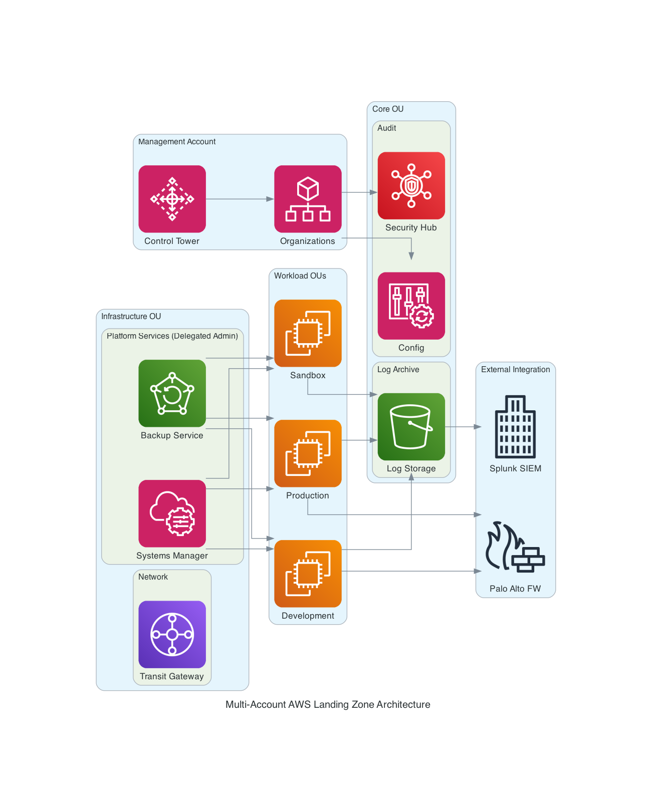

# AWS CloudWAN Architecture Design

**Generated on:** 2025-10-15 15:19:49

**Query:** Design a multi account landing zone with different OUs, common platform services such as patching, backup in a delegatedadminstrator club. With external integration to splunk and palo alto firewalls

## Architecture Diagram



**Diagram Location:** ``./outputs/generated-diagrams/aws_landing_zone_architecture.png``

## Design Details and Implementation Guide

Perfect! Now let me provide you with a comprehensive multi-account AWS Landing Zone design with delegated administration for platform services and external integrations.

# Multi-Account AWS Landing Zone Design with Delegated Administration

The diagram is saved at: `./outputs/generated-diagrams/aws_landing_zone_architecture.png`

## Executive Summary

This design provides a Well-Architected multi-account AWS Landing Zone leveraging AWS Control Tower for governance, with dedicated organizational units (OUs) for different environments and a centralized platform services account using delegated administration for patching, backup, and monitoring. External integrations with Splunk and Palo Alto firewalls ensure comprehensive security and observability.

## 1. Account Structure and Organization Units (OUs)

### Management Account
**Purpose**: Root account for AWS Organizations and Control Tower
- **AWS Control Tower**: Provides landing zone setup and governance
- **AWS Organizations**: Manages account hierarchy and SCPs
- **Organization-wide CloudTrail**: Centralized audit logging
- **Consolidated Billing**: Cost management and optimization

### Core OU
Contains foundational accounts that support the entire organization:

#### Log Archive Account
- **Amazon S3**: Centralized log storage with lifecycle policies
- **CloudTrail Logs**: Organization-wide API call logging
- **VPC Flow Logs**: Network traffic analysis
- **AWS Config Logs**: Configuration compliance history
- **Cross-Region Replication**: DR and compliance requirements

#### Audit Account
- **AWS Config**: Multi-account configuration compliance
- **AWS Security Hub**: Centralized security findings
- **Amazon GuardDuty**: Threat detection across all accounts
- **AWS Inspector**: Vulnerability assessments
- **AWS CloudWatch**: Cross-account monitoring dashboards

### Security OU
Centralized security services and identity management:

#### Shared Security Account
- **IAM Identity Center**: Single sign-on and centralized identity
- **AWS Secrets Manager**: Cross-account secrets management
- **AWS KMS**: Customer-managed encryption keys
- **AWS Certificate Manager**: SSL/TLS certificate management
- **AWS Resource Access Manager (RAM)**: Resource sharing

### Infrastructure OU
Shared infrastructure and platform services:

#### Network Account
- **AWS Transit Gateway**: Central connectivity hub
- **Route 53 Resolver**: DNS resolution for hybrid connectivity
- **Shared Services VPC**: Common infrastructure services
- **VPC Peering/Transit Gateway Attachments**: Inter-account connectivity
- **AWS Network Firewall**: Centralized network security

#### Platform Services Account (Delegated Administrator)
This account serves as the delegated administrator for:
- **AWS Systems Manager**: 
  - Cross-account patch management
  - Inventory management
  - Parameter Store for configuration
  - Session Manager for secure access
- **AWS Backup**: 
  - Organization-wide backup policies
  - Cross-account backup vaults
  - Compliance reporting
- **Amazon CloudWatch**: Centralized monitoring and alerting
- **AWS Systems Manager Quick Setup**: Automated service configuration

### Workload OUs

#### Production OU
- **Production Accounts**: Mission-critical workloads
- **High Availability**: Multi-AZ deployments
- **Strict Change Management**: Automated deployment pipelines
- **Enhanced Monitoring**: Detailed CloudWatch metrics and alarms

#### Development OU
- **Development Accounts**: Application development and testing
- **Cost Controls**: Automated resource cleanup
- **Development Tools**: CodeCommit, CodeBuild, CodeDeploy

#### Sandbox OU
- **Individual Developer Accounts**: Experimentation and learning
- **Flexible Policies**: Reduced restrictions for innovation
- **Cost Limits**: Budget controls and automatic shutdowns

## 2. Delegated Administration Configuration

### Systems Manager Delegated Administration
Based on the AWS documentation review, here's the implementation:

```yaml
Delegated Administrator Setup:
  Account: Platform Services Account
  Services:
    - AWS Systems Manager (all capabilities)
    - AWS Backup (organization-wide policies)
    - Amazon CloudWatch (cross-account dashboards)
  
  Permissions Required:
    - AWSOrganizationsFullAccess (in Management Account)
    - AWSSystemsManagerOrganizationAdminAccess
    - AWSBackupOrganizationAdminAccess
```

#### Platform Services Implementation:

**1. Patch Management**
- **Patch Groups**: Organized by environment (prod, dev, sandbox)
- **Maintenance Windows**: Scheduled during low-usage periods
- **Patch Baselines**: Custom baselines for different OS types
- **Compliance Reporting**: Automated compliance dashboards
- **Cross-Account Patching**: Delegated admin manages all accounts

**2. Backup Management**
- **Backup Policies**: Organization-wide backup requirements
- **Backup Vaults**: Cross-account backup storage
- **Recovery Testing**: Automated backup validation
- **Compliance Reporting**: Backup compliance across all accounts

**3. Monitoring and Operations**
- **CloudWatch Dashboards**: Cross-account operational visibility
- **EventBridge Rules**: Automated incident response
- **Systems Manager Explorer**: Centralized operations data
- **OpsCenter**: Centralized operational work items

## 3. External Integrations

### Splunk Integration
**Data Sources**:
- CloudTrail logs from S3 Log Archive
- VPC Flow Logs
- AWS Config logs
- Application logs via CloudWatch Logs

**Implementation**:
```yaml
Splunk Integration:
  Method: AWS Add-on for Splunk
  Data Sources:
    - S3 buckets (Log Archive Account)
    - Kinesis Data Firehose streams
    - CloudWatch Logs subscriptions
  
  Authentication:
    - Cross-account IAM roles
    - Least privilege access
    - Time-based access tokens
  
  Data Format:
    - JSON structured logs
    - Normalized timestamps
    - Account/region tagging
```

### Palo Alto Firewall Integration
**Network Security**:
- Transit Gateway route tables direct traffic through Palo Alto instances
- Centralized firewall policies managed from Panorama
- High availability across multiple AZs

**Implementation**:
```yaml
Palo Alto Integration:
  Deployment: VM-Series in Security VPC
  Configuration:
    - Active/Passive HA pair
    - Auto-scaling based on traffic
    - Centralized management via Panorama
  
  Traffic Flow:
    - North-South: Internet → Palo Alto → Workloads
    - East-West: Workload → Palo Alto → Workload
  
  Integration Points:
    - AWS Network Load Balancer
    - Transit Gateway route tables
    - CloudWatch metrics and alarms
```

## 4. Security and Compliance Framework

### Service Control Policies (SCPs)
- **Production OU**: Restrictive policies preventing resource deletion
- **Development OU**: Moderate restrictions with cost controls
- **Sandbox OU**: Permissive policies with spending limits

### Identity and Access Management
- **IAM Identity Center**: Centralized user authentication
- **Cross-Account Roles**: Least privilege access patterns
- **Temporary Credentials**: No long-term access keys
- **MFA Requirements**: Enforced for all privileged operations

### Compliance and Auditing
- **AWS Config Rules**: Automated compliance checking
- **Security Hub**: Centralized compliance dashboards
- **CloudTrail**: Immutable audit logs
- **AWS Artifact**: Compliance documentation access

## 5. Network Architecture

### Connectivity Model
```
Internet Gateway
       ↓
   Palo Alto FW (Security VPC)
       ↓
Transit Gateway (Network Account)
       ↓
┌─────────────┬─────────────┬─────────────┐
│ Production  │ Development │   Sandbox   │
│    VPC      │     VPC     │     VPC     │
└─────────────┴─────────────┴─────────────┘
```

### DNS Resolution
- **Route 53 Resolver**: Hybrid DNS resolution
- **Private Hosted Zones**: Internal service discovery
- **Conditional Forwarding**: On-premises integration

## 6. Cost Optimization Strategy

### Resource Management
- **AWS Budget**: Account-level spending alerts
- **Cost Allocation Tags**: Detailed cost tracking
- **Reserved Instances**: Commitment-based savings for predictable workloads
- **Spot Instances**: Cost optimization for fault-tolerant workloads

### Platform Services Cost Model
- **Shared Services**: Economies of scale through centralization
- **Cross-Account Billing**: Chargeback to consuming accounts
- **Automation**: Reduced operational overhead

## 7. Implementation Roadmap

### Phase 1: Foundation Setup (Weeks 1-4)
- **Stories (Large)**:
  - Set up AWS Control Tower and core accounts
  - Configure Organization SCPs and account structure
  - Establish Log Archive and Audit accounts
- **Cost Impact**: AWS Control Tower ($0), Organizations ($0), CloudTrail (~$2/trail/month)

### Phase 2: Platform Services (Weeks 5-8)
- **Stories (Medium-Large)**:
  - Configure delegated administrator for Systems Manager
  - Set up centralized patch management
  - Implement cross-account backup policies
  - Deploy monitoring dashboards
- **Cost Impact**: Systems Manager (~$5/managed node/month), Backup (storage costs only)

### Phase 3: External Integrations (Weeks 9-12)
- **Stories (Medium)**:
  - Configure Splunk integration with S3 and Kinesis
  - Deploy Palo Alto VM-Series instances
  - Set up network routing and security policies
- **Cost Impact**: Palo Alto instances (~$3,000-5,000/month), Data transfer costs

### Phase 4: Workload Migration (Weeks 13-16)
- **Stories (Small-Medium)**:
  - Deploy workload accounts
  - Migrate existing workloads
  - Implement monitoring and alerting
  - Validate backup and recovery procedures

## 8. Operational Excellence

### Monitoring and Alerting
- **CloudWatch Dashboards**: Real-time operational visibility
- **EventBridge**: Event-driven automation
- **SNS Notifications**: Multi-channel alerting
- **PagerDuty Integration**: Incident management

### Automation
- **CloudFormation StackSets**: Consistent resource deployment
- **Systems Manager Automation**: Operational runbooks
- **Lambda Functions**: Event-driven processing
- **Step Functions**: Complex workflow orchestration

### Business Continuity
- **Multi-Region Design**: DR capabilities for critical workloads
- **Cross-Region Backup**: Data protection and compliance
- **Disaster Recovery Testing**: Automated recovery validation
- **RTO/RPO Definitions**: Clear recovery objectives

## Key Benefits

1. **Centralized Management**: Delegated administration reduces operational overhead
2. **Security by Design**: Defense in depth with multiple security layers
3. **Compliance Ready**: Built-in governance and audit capabilities
4. **Cost Optimization**: Shared services and automated resource management
5. **Scalability**: Designed to grow with organizational needs
6. **External Integration**: Seamless integration with existing security tools

This architecture provides a solid foundation for enterprise-scale AWS adoption while maintaining security, compliance, and operational efficiency through centralized platform services and external tool integration.


---

## Next Steps

1. Review the architecture design above
2. Validate the design meets your specific requirements
3. Use the implementation guide to deploy the infrastructure
4. Test connectivity and security controls
5. Monitor performance and costs


## Service Status and Integration Report
- **System Mode**: full
- **Available Features**: diagram_generation, documentation_access, cost_estimation
- **Active MCP Clients**: diagram, knowledge, pricing

### MCP Client Status
- ✅ **Diagram**: Connected
- ✅ **Knowledge**: Connected
- ✅ **Pricing**: Connected

### Integration Validation
- **Total Tools Available**: 0
- **Enhanced Processing**: ❌ Unavailable
- **Output Processing**: ✅ Active

**Documentation saved at:** `./outputs/aws_design_20251015_151949.md`
