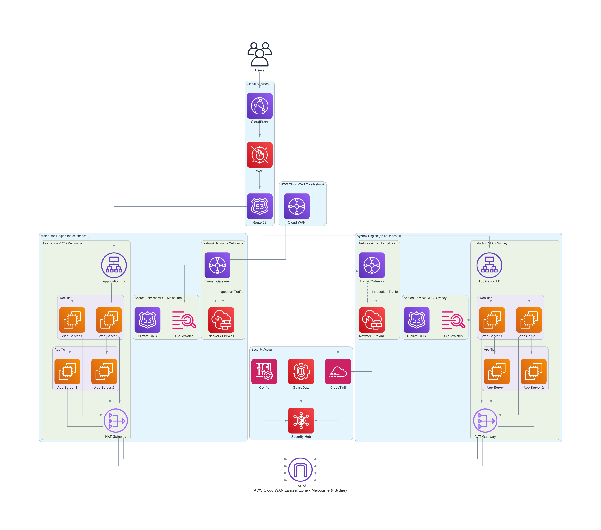

# AWS CloudWAN Architecture Design

**Generated on:** 2025-09-18 09:51:23

**Query:** Design a real-world AWS cloudWAN network for a Melbourne and Sydney regions that must have centralised packet inspection, decentralised egress, centralied ingress that will host web applications which serves thousands of users with low latency, strong security controls, and predictable costs.

## Architecture Diagram


**Diagram Location:** `./docs/aws_cloudwan_landing_zone.png`

## Design Details and Implementation Guide

The diagram is saved at: ./generated-diagrams/aws_cloudwan_landing_zone.png

## Detailed Implementation Guide

### Phase 1: Foundation Setup (Weeks 1-2)

#### 1. **AWS Organizations Structure**
```bash
# Create organizational structure
aws organizations create-organization --feature-set ALL

# Create OUs
aws organizations create-organizational-unit --parent-id r-xxx --name "Network"
aws organizations create-organizational-unit --parent-id r-xxx --name "Security" 
aws organizations create-organizational-unit --parent-id r-xxx --name "Production"
aws organizations create-organizational-unit --parent-id r-xxx --name "SharedServices"
```

#### 2. **Service Control Policies (SCPs)**
- Restrict root user access
- Enforce encryption in transit and at rest
- Prevent deletion of CloudTrail
- Restrict instance types to cost-optimized families

### Phase 2: Network Foundation (Weeks 2-4)

#### 1. **Cloud WAN Core Network**
```bash
# Create Cloud WAN Global Network
aws networkmanager create-global-network \
    --description "Melbourne-Sydney Global Network"

# Create Core Network
aws networkmanager create-core-network \
    --global-network-id global-network-xxx \
    --policy-document file://core-network-policy.json
```

**Core Network Policy** (JSON):
```json
{
  "version": "2021.12",
  "core-network-configuration": {
    "asn-ranges": ["64512-65534"],
    "edge-locations": [
      {
        "location": "ap-southeast-2",
        "asn": 64512
      },
      {
        "location": "ap-southeast-4", 
        "asn": 64513
      }
    ]
  },
  "segments": [
    {
      "name": "production",
      "require-attachment-acceptance": false,
      "isolate-attachments": false
    },
    {
      "name": "shared-services",
      "require-attachment-acceptance": false
    },
    {
      "name": "security",
      "require-attachment-acceptance": true
    }
  ],
  "segment-actions": [
    {
      "action": "share",
      "segment": "production",
      "share-with": ["shared-services"]
    }
  ]
}
```

#### 2. **Regional Transit Gateways**
```bash
# Melbourne Transit Gateway
aws ec2 create-transit-gateway \
    --description "Melbourne TGW" \
    --options=DefaultRouteTableAssociation=enable,DefaultRouteTablePropagation=enable \
    --region ap-southeast-2

# Sydney Transit Gateway  
aws ec2 create-transit-gateway \
    --description "Sydney TGW" \
    --options=DefaultRouteTableAssociation=enable,DefaultRouteTablePropagation=enable \
    --region ap-southeast-4
```

### Phase 3: Security Implementation (Weeks 3-5)

#### 1. **Network Firewall Deployment**
```bash
# Create Network Firewall in Melbourne
aws network-firewall create-firewall \
    --firewall-name Melbourne-NetworkFirewall \
    --firewall-policy-arn arn:aws:network-firewall:ap-southeast-2:xxx:firewall-policy/production-policy \
    --vpc-id vpc-xxx \
    --subnet-mappings SubnetId=subnet-xxx
```

**Firewall Rules**:
- **Stateless Rules**: Allow HTTPS (443), HTTP (80), SSH (22) from trusted sources
- **Stateful Rules**: Block known malicious IPs, allow outbound HTTPS
- **Domain Rules**: Block access to malicious domains, allow business-approved domains

#### 2. **WAF Configuration**
```bash
# Create WAF Web ACL
aws wafv2 create-web-acl \
    --name Production-WebACL \
    --default-action Allow={} \
    --rules file://waf-rules.json
```

### Phase 4: Application Infrastructure (Weeks 4-6)

#### 1. **VPC Architecture per Region**
```bash
# Production VPC - Melbourne
aws ec2 create-vpc --cidr-block 10.1.0.0/16 --region ap-southeast-2

# Subnets (Multi-AZ)
# Public subnets for ALB: 10.1.1.0/24, 10.1.2.0/24
# Private subnets for Web: 10.1.11.0/24, 10.1.12.0/24  
# Private subnets for App: 10.1.21.0/24, 10.1.22.0/24
# Private subnets for DB: 10.1.31.0/24, 10.1.32.0/24
```

#### 2. **Auto Scaling Groups**
```bash
# Web tier ASG
aws autoscaling create-auto-scaling-group \
    --auto-scaling-group-name web-tier-asg \
    --launch-configuration-name web-lc \
    --min-size 2 \
    --max-size 10 \
    --desired-capacity 4 \
    --vpc-zone-identifier subnet-xxx,subnet-yyy
```

### Phase 5: Monitoring & Observability (Weeks 5-7)

#### 1. **CloudWatch Dashboards**
- Network performance metrics
- Application latency metrics
- Security events dashboard
- Cost optimization metrics

#### 2. **Centralized Logging**
```bash
# VPC Flow Logs
aws ec2 create-flow-logs \
    --resource-type VPC \
    --resource-ids vpc-xxx \
    --traffic-type ALL \
    --log-destination-type cloud-watch-logs \
    --log-group-name /aws/vpc/flowlogs
```

## Well-Architected Framework Compliance

### Security Pillar ✅
- **Defense in Depth**: WAF → ALB → Security Groups → NACLs → Network Firewall
- **Zero Trust Network**: All traffic inspected through Network Firewall
- **Encryption**: All data encrypted in transit (TLS) and at rest
- **Identity Management**: IAM roles with least privilege access

### Reliability Pillar ✅
- **Multi-AZ Deployment**: Resources distributed across 3 AZs per region
- **Cross-Region Connectivity**: Cloud WAN provides automatic failover
- **Health Checks**: ALB and Route 53 health checks with automatic failover
- **Backup Strategy**: Automated EBS snapshots and cross-region replication

### Performance Efficiency Pillar ✅
- **Global Content Delivery**: CloudFront with edge locations for low latency
- **Auto Scaling**: Dynamic scaling based on CPU, memory, and custom metrics
- **Right-Sizing**: Instance types optimized for workload requirements
- **Network Optimization**: Transit Gateway for optimal routing

### Cost Optimization Pillar ✅
- **Decentralized Egress**: Reduces cross-region data transfer costs
- **Reserved Instances**: For predictable workloads (web and app tiers)
- **Spot Instances**: For development and testing environments
- **Resource Tagging**: Detailed cost allocation and optimization

### Operational Excellence Pillar ✅
- **Infrastructure as Code**: CloudFormation templates for all resources
- **Centralized Monitoring**: CloudWatch, CloudTrail, and Config
- **Automated Responses**: EventBridge rules for security incidents
- **Change Management**: AWS Config rules for compliance monitoring

## Cost Estimation (Monthly)

**Core Network Infrastructure**: ~$2,500/month
- Cloud WAN: $500
- Transit Gateways (2): $400
- Network Firewall (2): $800
- NAT Gateways (4): $800

**Compute Resources**: ~$1,800/month
- EC2 instances (8 x t3.large): $1,200
- Application Load Balancers (2): $400
- Auto Scaling: $200

**Global Services**: ~$800/month
- CloudFront: $300
- Route 53: $100
- WAF: $200
- Security Services: $200

**Total Estimated Monthly Cost**: ~$5,100

## Implementation Timeline

- **Week 1-2**: Organizations, IAM, and foundational security
- **Week 3-4**: Cloud WAN and Transit Gateway setup
- **Week 5-6**: Network Firewall and security controls
- **Week 7-8**: Application infrastructure deployment
- **Week 9-10**: Monitoring, logging, and optimization
- **Week 11-12**: Testing, documentation, and handover

This architecture provides enterprise-grade security, scalability, and cost optimization while maintaining the flexibility to adapt to changing business requirements. The centralized packet inspection ensures security compliance, while decentralized egress optimizes costs for your multi-region deployment.


---

## Next Steps

1. Review the architecture design above
2. Validate the design meets your specific requirements
3. Use the implementation guide to deploy the infrastructure
4. Test connectivity and security controls
5. Monitor performance and costs

**Documentation saved at:** `./docs/aws_design_20250918_095123.md`
